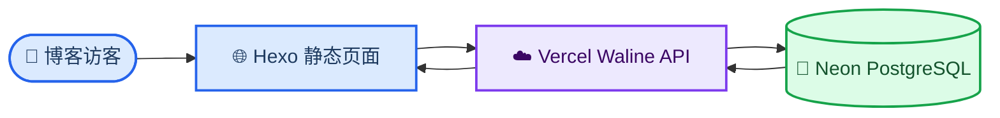

这篇文章记录一次完整的博客功能改造：在 Hexo Fluid 中保留原来的 Utterances 配置，但改用 Waline 提供无需 GitHub 登录的评论区；同时用 Waline 和 Neon 保存文章阅读量，并为异步加载增加“上次成功值”缓存。

整个过程并不是只改一行 `serverURL`。真正容易卡住的地方，是 Vercel 函数已经部署成功但数据库还没有准备好、Neon 集成生成的变量名未被 Waline 识别，以及阅读量元素虽然存在却没有正确交给 Waline 更新。

<!-- more -->

## 📋 最终方案

最终结构如下：



三个部分分工明确：

| 部分 | 作用 | 平时是否需要操作 |
| --- | --- | --- |
| Hexo + Fluid | 生成博客页面并挂载评论、阅读量组件 | 写文章和调整主题时使用 |
| Vercel | 运行 Waline 服务端、保存环境变量、提供日志 | 出现 500、修改变量或升级时查看 |
| Neon | 保存评论、用户和文章阅读量 | 通常无需日常操作，偶尔查看用量和数据 |

Vercel 面板里的 `Edge Requests`、`Function Invocations` 和 `Error Rate` 是服务运行指标，不等于每篇文章的阅读量。文章阅读量由 Waline 统计，真实数据保存在 Neon；博客页面只是通过 Waline API 取回并显示。

对于个人博客，不需要另外购买传统服务器。Vercel Hobby 和 Neon Free 可以先完成部署，但仍应关注两家平台当时的免费额度与使用条款。Waline 官方快速开始也把 Vercel 与 Neon 作为一套部署路径。[Waline 快速开始][waline-start]

## 🔧 部署 Waline 服务端

### 从模板创建 Vercel 项目

在 Vercel 创建项目时，使用 Waline 官方模板导入 `walinejs/waline` 的 `example` 目录，选择自己的 Git Scope，填写一个私有仓库名称后创建。


*图 1：Vercel 根据 Waline 模板创建项目和对应 Git 仓库*

部署完成后会得到类似下面的服务地址：

```text
https://your-waline.vercel.app
```

这个地址不是博客地址，而是博客调用的评论 API。后面需要把它填入 Fluid 的 `waline.serverURL`。

### 为什么第一次访问会出现 500

第一次部署后，页面可能显示：

```text
500 FUNCTION_INVOCATION_FAILED
```


*图 2：Vercel 函数已经创建，但运行时仍然失败*

真正原因需要在 Vercel 的 `Logs` 中查看。本次日志是：

```text
Error: No valid storage found. Please check your environment variables.
Node.js process exited with exit status: 1.
```

这说明 Vercel 函数本身已经运行，但 Waline 没找到可用数据库。继续刷新页面或重复部署不会解决问题，必须先建立并连接存储。

## 💾 创建并初始化 Neon 数据库

### 创建 Neon PostgreSQL

进入 Waline 项目的 `Storage` 或 Marketplace，创建 Neon 数据库。完成 Neon 账号连接后，数据库状态应为 `Available`。


*图 3：Neon 数据库已经创建，并提供 PostgreSQL 连接变量*

如果连接 Neon 账号时提示验证邮箱，应先在邮箱中完成验证，再返回 Vercel 继续连接。验证邮件可能包含个人邮箱地址，不建议将该页面直接发布到文章或公开仓库。

### 将数据库连接到 Waline 项目

点击 `Connect to Project`，选择 Waline 的 Vercel 项目，并至少勾选 `Production`。如果还需要预览部署，也可以同时勾选 `Preview`。


*图 4：数据库资源与 Vercel 项目建立连接*

不要随意填写自定义环境变量前缀。若变量被改成 `STORAGE_URL` 一类名称，Waline 不一定能识别它。Waline 的 PostgreSQL 配置使用 `PG_*`，也支持 `POSTGRES_*` 别名。[Waline 服务端环境变量][waline-env]

建议在 Vercel 的 `Environment Variables` 中确认以下变量存在，值从 Neon 的连接信息复制：

| 环境变量 | 值的来源 |
| --- | --- |
| `POSTGRES_DATABASE` | Neon 数据库名称 |
| `POSTGRES_USER` | Neon 用户名 |
| `POSTGRES_PASSWORD` | Neon 密码 |
| `POSTGRES_HOST` | Neon 主机地址 |
| `POSTGRES_PORT` | Neon 连接端口 |
| `POSTGRES_SSL` | `true` |

也可以使用等价的 `PG_DB`、`PG_USER`、`PG_PASSWORD`、`PG_HOST`、`PG_PORT` 和 `PG_SSL`。密码、完整连接串和令牌都应保存为 Secret，不能写入博客源码或截图。

### 导入 Waline 数据表

只有数据库实例还不够，还需要执行 Waline 官方的 `waline.pgsql` 来创建表结构。官方流程是在 Neon 控制台打开 SQL Editor，粘贴脚本并运行。[Waline 数据库支持][waline-database]


*图 5：集成页面也有 Query 入口，但不一定适合直接运行整份建表脚本*

如果看到：

```text
cannot insert multiple commands into a prepared statement
```

说明当前查询入口把整段 SQL 当作一条 prepared statement，而 `waline.pgsql` 包含多条命令。解决方法是：

1. 点击 `Open in Neon` 进入 Neon 官方控制台
2. 使用 Neon 的 SQL Editor，而不是只读或 prepared query 入口
3. 粘贴完整 `waline.pgsql` 并执行
4. 如果所用编辑器仍限制多语句，则按分号拆分后逐条运行
5. 在 `Schema` 或 `Tables` 中确认 Waline 表已经出现

不要为了绕过这个错误而手工删掉建表语句，否则可能得到一个“能连接但缺表”的数据库。

## 🚀 重新部署并注册管理员

数据库表和环境变量准备好以后，必须重新部署，旧的函数实例才会加载新变量。Vercel 官方也建议在修改环境变量后执行 Redeploy。[Vercel 重新部署][vercel-redeploy]

进入：

```text
Waline 项目 → Deployments → 最新部署 → 右侧“…” → Redeploy
```


*图 6：Redeploy 位于部署记录右上角的省略号菜单*

部署状态变成 `Ready` 后访问服务地址。若仍然出现 500，应回到 `Logs` 看最新一条错误，而不是查看旧部署日志。

服务正常后访问：

```text
https://your-waline.vercel.app/ui/register
```

第一个完成注册的用户会成为管理员。之后通过 `/ui` 登录，可以管理评论和用户。[Waline 快速开始][waline-start]

Waline 评论并不要求普通访客必须使用 GitHub 登录。前端可以允许访客直接填写昵称、邮箱和网址；本博客只把昵称设为必填，社交登录只是可选能力。

## ⚙️ 在 Fluid 中启用 Waline

编辑 `themes/fluid/_config.yml`，把评论类型切换为 Waline：

```yaml
post:
  comments:
    enable: true
    type: waline
```

然后填写 Waline 配置：

```yaml
waline:
  serverURL: 'https://your-waline.vercel.app'
  pageview: true
  path: window.location.pathname
  meta: ['nick', 'mail', 'link']
  requiredMeta: ['nick']
  lang: 'zh-CN'
  dark: 'html[data-user-color-scheme="dark"]'
  wordLimit: 0
  pageSize: 10
```

原来的 Utterances 配置可以继续保留：

```yaml
utterances:
  repo: your-name/your-repository
  issue_term: pathname
  label: comment
  theme: github-light
```

因为 `post.comments.type` 已经是 `waline`，主题不会再加载 Utterances。这样以后想切换回来时，只需改 `type`。

但如果个别文章中曾经直接写过下面的脚本，它会绕过主题开关，仍然加载 GitHub 评论：

```html
<script src="https://utteranc.es/client.js"></script>
```

应删除文章里重复的 Utterances 脚本，只保留主题配置。这就实现了“原配置保留，但当前不使用”。

## 📊 接入文章阅读量

### 为什么配置打开后页面仍不显示

Waline 官方的阅读量功能需要同时满足两个条件：[Waline 浏览量统计][waline-pageview]

1. 初始化 Waline 时设置 `pageview: true`
2. 页面存在 `class="waline-pageview-count"` 的元素，并通过 `data-path` 指定文章路径

本次最初把 Waline 元素放进了 Fluid 的 `busuanzi` 分支，还继续加载了不蒜子脚本。这会让配置含义混乱，而且模板里使用 `post.path` 也可能拿不到当前文章。最终改为独立判断 `theme.waline.pageview`，并使用当前模板上下文中的 `page.path`。

编辑：

```text
themes/fluid/layout/_partials/post/meta-top.ejs
```

核心结构如下：

```ejs
<% var waline_views_texts = (theme.post.meta.views.format || __('post.meta.views')).split('{}') %>

<% if (theme.waline.pageview && waline_views_texts.length >= 2) { %>
  <span class="post-meta mr-2 waline-pageview-meta">
    <i class="iconfont icon-eye" aria-hidden="true"></i>
    <%- waline_views_texts[0] %>
    <span
      class="waline-pageview-count"
      data-path="<%= url_for(page.path) %>">
    </span>
    <%- waline_views_texts[1] %>
  </span>
<% } %>
```

对应的文字格式仍可保留在 Fluid 配置中：

```yaml
post:
  meta:
    views:
      enable: false
      source: "busuanzi"
      format: "{} 次"
```

这里的 `enable: false` 是有意的：内置的 Busuanzi/LeanCloud/Umami 分支不再使用，显示条件已经交给 `theme.waline.pageview`。

### 为什么眼睛图标先出现，数字后出现

阅读量需要经过浏览器、Vercel Waline API 和 Neon 数据库，是异步网络请求。图标来自静态 HTML，所以立刻出现；数字需要等待请求返回。[Waline 浏览量统计][waline-pageview]

为了避免每次刷新都先空白，可以把“当前浏览器上一次成功取得的值”保存到 `localStorage`。页面打开时先显示旧值，Waline 返回后再替换并写入新值：

```html
<script>
  (function () {
    var meta = document.querySelector('.waline-pageview-meta');
    var count = meta && meta.querySelector('.waline-pageview-count');

    if (!count) return;

    var path = count.getAttribute('data-path') || window.location.pathname;
    var cacheKey = 'waline-pageview:' + window.location.host + ':' + path;

    function isValidCount(value) {
      return /^\d+$/.test(String(value).replace(/[,\s]/g, ''));
    }

    try {
      var cachedCount = window.localStorage.getItem(cacheKey);
      count.textContent = isValidCount(cachedCount) ? cachedCount : '…';
    } catch (error) {
      count.textContent = '…';
    }

    var observer = new MutationObserver(function () {
      var freshCount = count.textContent.trim();

      if (!isValidCount(freshCount)) return;

      try {
        window.localStorage.setItem(cacheKey, freshCount);
      } catch (error) {
        // 隐私模式可能禁止 localStorage。
      }
    });

    observer.observe(count, {
      childList: true,
      characterData: true,
      subtree: true
    });
  })();
</script>
```

这段缓存不会伪造或覆盖 Neon 中的真实统计，只改善显示过程：

- 第一次访问且没有缓存时显示 `…`
- Waline 返回后显示并保存新值
- 下次访问先显示上次值
- 新请求完成后再次覆盖缓存

需要明确的是，`localStorage` 属于浏览器设备。换浏览器或换设备后没有旧缓存，但 Neon 中的真实阅读量仍然共享。如果希望所有设备一打开就显示同一份静态旧值，就必须在构建阶段从数据库同步阅读量、写入 HTML 并重新部署；纯静态 Hexo 页面无法自行修改已经发布的文章文件。

## 🔍 构建与验证

Windows PowerShell 可能禁止执行 `npm.ps1`，直接运行 `npm run build` 会得到 `PSSecurityException`。不必修改系统执行策略，使用 `npm.cmd` 即可：

```powershell
cd D:\antonalia.github.io
npm.cmd run clean
npm.cmd run build
```

成功时会看到类似：

```text
INFO  12 files generated
```

如果电脑没有安装 `rg`，可以用 PowerShell 检查生成页面：

```powershell
Get-ChildItem .\public -Recurse -File |
  Select-String -Pattern "waline-pageview-count","waline-pageview:"
```

至少应在各篇文章的 `public\...\index.html` 中找到：

```text
class="waline-pageview-count"
```

最终访问 Waline 服务时，可以看到完整评论输入框，昵称、邮箱和网址字段均可使用。


*图 7：数据库和服务端连接成功后的 Waline 评论界面*

建议再完成下面四项实际测试：

1. 使用未登录浏览器提交一条测试评论
2. 登录 `/ui` 确认管理员能看到并管理评论
3. 连续刷新文章，确认阅读量会更新
4. 第二次打开同一文章，确认旧值先显示、新值随后覆盖

## ⚠️ 常见错误对照

| 现象 | 真实原因 | 处理方法 |
| --- | --- | --- |
| `500 FUNCTION_INVOCATION_FAILED` | Vercel 函数运行失败 | 打开当前部署的 Logs |
| `No valid storage found` | Waline 未识别数据库变量 | 补齐 `PG_*` 或 `POSTGRES_*` |
| `cannot insert multiple commands...` | 查询入口限制多条 prepared commands | 改用 Neon SQL Editor |
| 环境变量已添加但仍报旧错误 | 当前部署没有加载新变量 | 对最新部署执行 Redeploy |
| 评论框存在但文章仍加载 GitHub 登录 | 文章中残留 Utterances 脚本 | 删除文章内联脚本 |
| 有眼睛图标但没有数字 | 缺少 Waline 计数元素或路径错误 | 使用 `waline-pageview-count` 和 `page.path` |
| PowerShell 禁止 `npm.ps1` | 系统执行策略拦截脚本 | 使用 `npm.cmd` |
| `rg` 无法识别 | 未安装 ripgrep | 使用 `Get-ChildItem | Select-String` |

## 🔐 LeanCloud 停服是否影响当前方案

Waline 社区已经发布 LeanCloud 停止对外服务的迁移提醒。[LeanCloud 停服讨论][leancloud-stop]

当前方案使用的是 Neon PostgreSQL，评论、用户和阅读量都不依赖 LeanCloud，因此该停服通知不会影响正在运行的 Waline 服务。主题中保留旧 Valine 或 LeanCloud 配置，也不代表它正在被调用；当前实际使用者由 `post.comments.type: waline` 和 Waline 服务端数据库变量决定。

但“服务不受影响”和“旧数据已经迁移”是两回事。如果以前的评论只存在 LeanCloud 中，应在服务停止前单独导出并迁移。仅仅切换评论组件不会自动搬运历史评论。

## 📌 Vercel 与 Neon 以后怎么维护

正常运行以后，不需要每天登录这两个网站。

需要查看 Vercel 的情况：

- Waline 页面出现 500
- 修改数据库或邮件等环境变量
- 查看函数日志和错误率
- 更新 Waline 服务端版本
- 触发 Redeploy

需要查看 Neon 的情况：

- 检查数据库用量和状态
- 查询或备份评论数据
- 确认数据库表是否存在
- 调查连接数、休眠唤醒或数据库错误

任何时候都不要把 `POSTGRES_PASSWORD`、完整数据库 URL、邮箱授权码或管理令牌提交到 Git 仓库。公开截图也应先检查邮箱地址和连接字符串是否被遮挡。

## 📚 额外调整

如果不希望每篇文章末尾显示 Fluid 的 Creative Commons 许可框，可以全局关闭：

```yaml
post:
  copyright:
    enable: false
```

这只影响页面展示，不影响 Waline 评论、阅读量或文章本身的版权状态。引用第三方内容时，仍应遵守来源对应的署名和许可要求。

## 🔗 参考资料

- [Waline 快速开始][waline-start]
- [Waline 服务端环境变量][waline-env]
- [Waline 多数据库支持][waline-database]
- [Waline 浏览量统计][waline-pageview]
- [Vercel 部署管理][vercel-redeploy]
- [Waline 社区关于 LeanCloud 停止服务的讨论][leancloud-stop]

[waline-start]: https://waline.js.org/guide/get-started/
[waline-env]: https://waline.js.org/reference/server/env.html
[waline-database]: https://waline.js.org/guide/database.html
[waline-pageview]: https://waline.js.org/guide/features/pageview.html
[vercel-redeploy]: https://vercel.com/docs/deployments/managing-deployments
[leancloud-stop]: https://github.com/orgs/walinejs/discussions/3370

